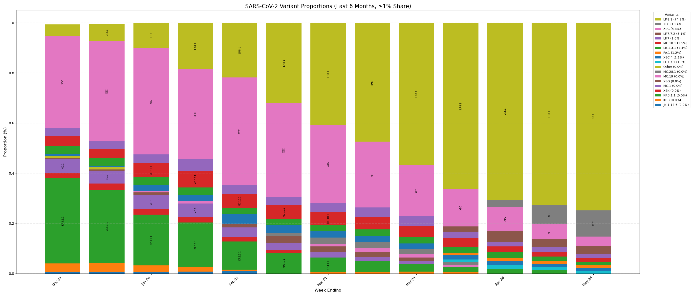

# CDC SARS-CoV-2 Variant Visualization

This project generates a stacked bar chart of SARS-CoV-2 variant proportions in the United States, using real-time data from the CDC's public API. The chart covers the **last 6 months** and includes only variants that have ever reached **≥1% prevalence**.

> Built to update biweekly as new CDC data becomes available.

---

## 📊 Example Output



---

## ✨ Features

- 📡 Live API pull from [data.cdc.gov](https://data.cdc.gov/resource/jr58-6ysp)

- 🕒 Auto-filtered to past 6 months
- 📉 Stacked bars for each week, with:
  - Variant names labeled inline
  - Proportions in the legend
  - Top-down ordering by latest prevalence
- 🎨 Clean visual styling and grid
- 💾 Ready to run locally or embed in dashboards

---

## 🧪 How to Run

```bash
pip install pandas matplotlib requests
python variants_api.py
